# DNS代管 \(Cloudflare\)

## 誰需要 DNS 代管 ?

* 無力自行架設網域名稱伺服器 \(Domain Name Server, DNS\) 
* 擔心自行架設的伺服器遭到入侵或成為跳板
* 不想負擔 DNS 的營運管理成本，如：全年無休的電費
* 域名註冊商提供的 DNS 代管功能陽春，允許的 DNS 紀錄 \(DNS record\) 的種類、數量有限

## Cloudflare 的設定流程 :

1. 註冊新帳戶
2. 加入域名
3. 選擇使用方案
4. 更新網域名稱伺服器  設定


上述第 4 點是在域名註冊商設定，不是在 Cloudflare 設定。


## Step 1 : 建立並登入帳戶後，點選右上角的 \[Add site\]

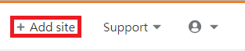

## Step 2 : 填入域名

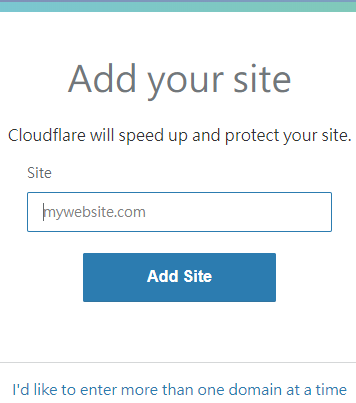

## Step 3 : 選擇方案

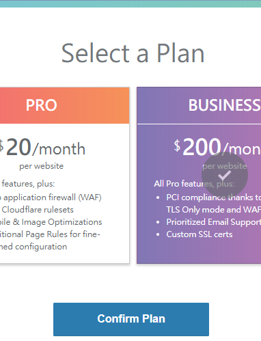

## Step 5 : Cloudflare 提供的 FREE 已包含 SSL 證書

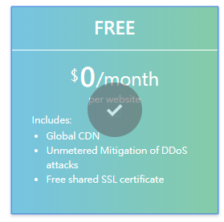

## Step 6 : 由於還未設定，所以會出現以下畫面

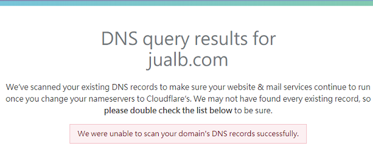

## Step 7 : DNS 紀錄的設定可先略過，先點選 \[Continue\]

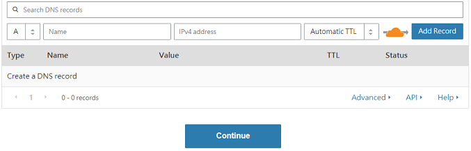

## Step 8 : 網頁提示至域名註冊商更改 DNS 設定，設定完成後，點擊 \[Continue\]

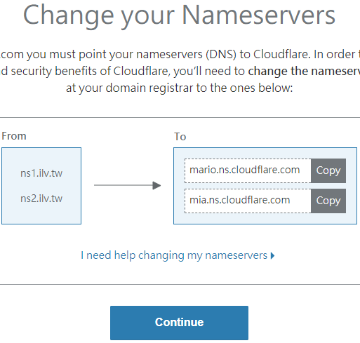

## Step 9 : 在域名註冊商的管理頁面中，選擇 \[使用自訂的名稱伺服器\]

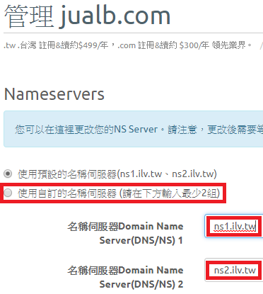

## Step 10 : 將預設的 DNS 改成 Cloudflare 提供的 DNS

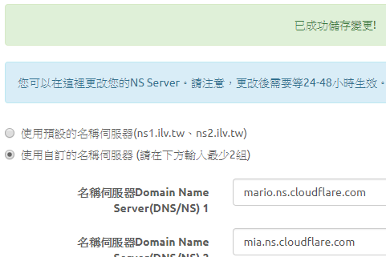

## Step 11 : 回到 Cloudflare，點擊 \[Recheck Nameservers\]

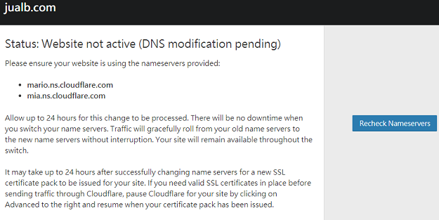

## Step 12 : 頁尾出現如下訊息

## Step 13 : 經過一段時間（短則幾分鐘，長則 24 小時），狀態成為「Active」

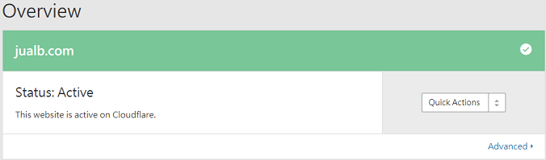

## Step 14 : 收到 Cloudflare 信件，告知已成功設定

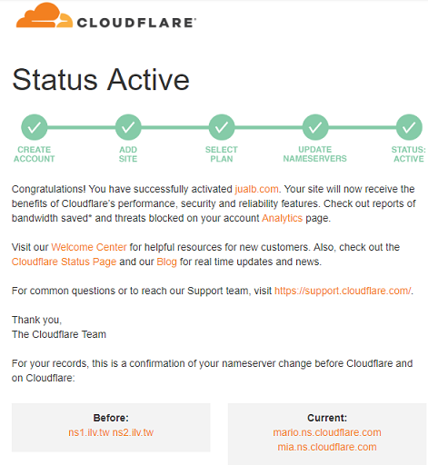

