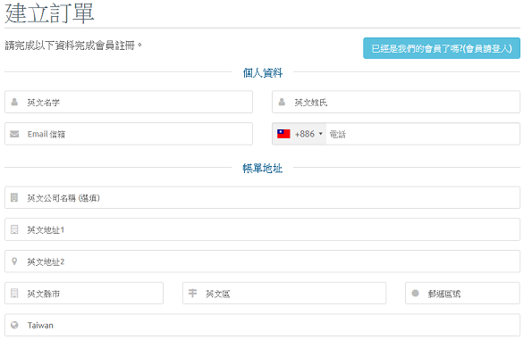

# 購買網域名稱 \(Domain Name\)

## 誰適合購買網域名稱 ?

* 想擁有網站，並且想看起來專業一點。
* 已擁有網站，但不想自己網站的流量為他人作嫁衣。
* 想與眾不同，擺脫 「@yahoo.com.tw」、「 @gmail.com」、「 @outlook.com」等結尾的電子郵件信箱。
* 申請電子郵件信箱時，發現想要的使用者名稱都被申請了。
* 對允許自訂網域的各種服務感興趣者。

## 網域名稱的價格 ?

* 「.com」、「 .net」、「.org」一年約新台幣 300 ~ 500 元。
* 「.tw」一年約新台幣 500 ~ 800 元。
* 其他，免費至數千新台幣都有，詳細價格請洽各域名註冊商。

## 以下為購買流程 : 


簡單的說，購買網域名稱的流程就是「選可申請的域名」 + 「填寫個人資料」 + 「付款」，建議準備好英譯資料 \(姓名、地址\)。以下步驟將以鼎嘉數位有限公司為例。


## Step 1 : 進入官網，在紅框處輸入欲註冊的域名後，點選 \[Search\]

## Step 2 : 需再次點選 \[搜尋\]，若未被註冊，將出現如下畫面

## Step 3 : 點選 \[放入購物車\] ，按鈕會變成 \[結帳\]，再按 \[結帳\]

## Step 4 : 先依照預設值，按 \[Continue\] 即可

## Step 5 : 選擇購買幾年，如：1 Year。接著點選 \[建立訂單\]

## Step 6 : 填寫資料、設定密碼，用以註冊會員

## Step 7 : 選擇付款方式

## Step 8 : 至頁尾勾選 \[我已經閱讀並且同意服務條款\]，再點選 \[完成訂單\]

## Step 9 : 輸入信用卡訊息

## Step 10 : 確認資料

## Step 11 : 點選 \[取得簡訊傳送交易密碼\]

## Step 12 : 輸入交易密碼

## Step 13 : 等候一段時間

## Step 14 : 完成訂購

## Step 15 : 出現訂購的網址

## 注意事項 :


在 \[聯絡人資訊\] 中，若不 \[使用現有的帳戶聯絡人\] ，而是在 \[請於下面指定客戶資訊\] 中自行填入各項資料，倘若 Address 2 空白，將被自動填入數值 0 成為地址的一部分。因此，才以上圖的方式填寫。


