# 購買網域名稱 \(Domain Name\)

## 誰適合購買網域名稱 ?

* 想要擁有網站，並且想看起來專業一點。
* 已擁有網站，但不想自己網站的流量為他人作嫁衣。
* 想要與眾不同，擺脫 「@yahoo.com.tw」、「 @gmail.com」、「 @outlook.com」等結尾的電子郵件信箱。
* 申請電子郵件信箱時，發現想要的使用者名稱都被申請了。
* 對允許自訂網域的各種服務感興趣者。

## 網域名稱的價格 ?

　　目前，歷史悠久且十分普及的「.com」、「 .net」、「.org」大約是一年要價約美金 10 ~ 16 元 \(約新台幣 300 ~ 500 元\) 左右，有時國外的域名註冊商甚至會推出第一年幾乎免費的促銷，而有些則對特定的域名，如：「.pw」提供優惠。

　　另外，若要買「.tw」結尾的域名，建議直接透過台灣的域名註冊商註冊即可，費用大約新台幣 500 ~ 800 元，價格會比透過國外的域名註冊商漂亮許多。

## Step 1 : 登入會員，在 \[註冊新的網址\] 輸入欲申請的網址後，點選 \[新網址註冊價格\]

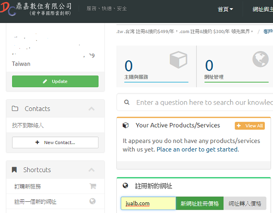

## Step 2 : 若輸入的網址沒被別人註冊，將出現如下畫面

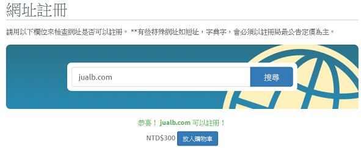

## Step 3 : 點選 \[放入購物車\] ，按鈕會變成 \[結帳\]，再按 \[結帳\]

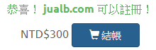

## Step 4 : 先依照預設值，按 \[Continue\] 即可

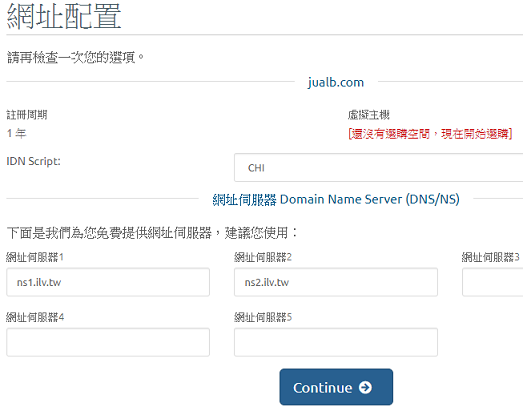

## Step 5 : 選擇購買幾年，如：1 Year。接著點選 \[建立訂單\]

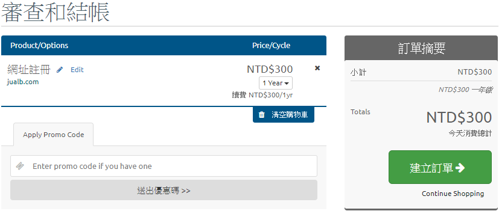

## Step 6 : 選擇付款方式

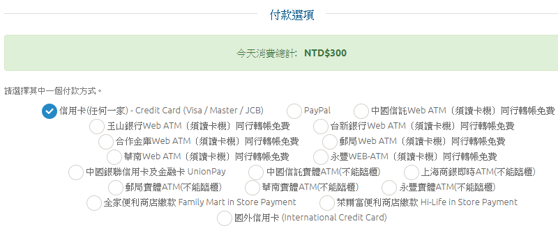

## Step 7 : 至頁尾勾選 \[我已經閱讀並且同意服務條款\]，再點選 \[完成訂單\]

## Step 8 : 輸入信用卡訊息

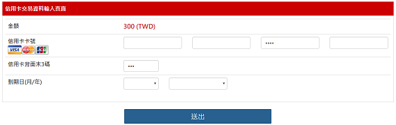

## Step 9 : 確認資料

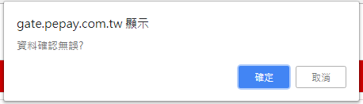

## Step 10 : 點選 \[取得簡訊傳送交易密碼\]

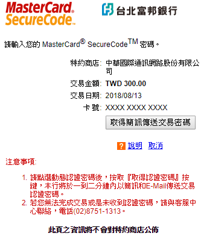

## Step 11 : 輸入交易密碼

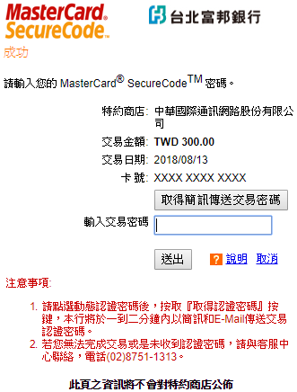

## Step 12 : 等候一段時間

## Step 13 : 完成訂購

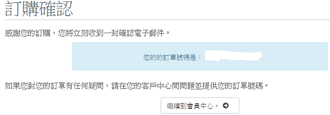

## Step 14 : 出現訂購的網址

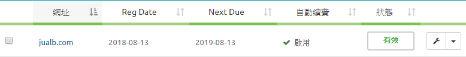

## 注意事項 :

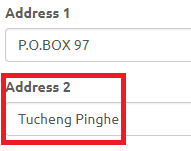


在 \[聯絡人資訊\] 中，若不 \[使用現有的帳戶聯絡人\] ，而是在 \[請於下面指定客戶資訊\] 中自行填入各項資料，倘若 Address 2 空白，將被自動填入數值 0 成為地址的一部分。因此，才以上圖的方式填寫。


