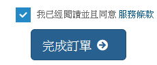

# 購買 Domain Name 及其基本設置

## Step 1 : 登入會員，在 \[註冊新的網址\] 輸入欲申請的網址後，點選 \[新網址註冊價格\]

## Step 2 : 若輸入的網址沒被別人註冊，將出現如下畫面

## Step 3 : 點選 \[放入購物車\] ，按鈕會變成 \[結帳\]，再按 \[結帳\]

## Step 4 : 先依照預設值，按 \[Continue\] 即可

## Step 5 : 選擇購買幾年，如：1 Year。接著點選 \[建立訂單\]

## Step 6 : 選擇付款方式

## Step 7 : 至頁尾勾選 \[我已經閱讀並且同意服務條款\]，再點選 \[完成訂單\]

## Step 8 : 輸入信用卡訊息

## Step 9 : 確認資料

## Step 10 : 點選 \[取得簡訊傳送交易密碼\]

## Step 11 : 輸入交易密碼

## Step 12 : 等候一段時間

## Step 13 : 完成訂購

## Step 14 : 出現訂購的網址

## 注意事項 :


在 \[聯絡人資訊\] 中，若不 \[使用現有的帳戶聯絡人\] ，而是在 \[請於下面指定客戶資訊\] 中自行填入各項資料，倘若 Address 2 空白，將被自動填入數值 0 成為地址的一部分。因此，才以上圖的方式填寫。


