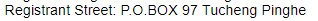

# 購買 Domain Name 及其基本設置

## Step 1 : 

## Step 2 : 

## Step 3 : 

## Step 4 : 

## Step 5 : 

## Step 6 : 

## Step 7 : 

## Step 8 : 

## Step 9 : 

## Step 10 : 

## Step 11 : 

## Step 12 : 

## Step 13 : 

## Step 14 : 

## Step 15 : 

## Step 16 : 

