# Google G Suite Domains Aliases

## Step 1

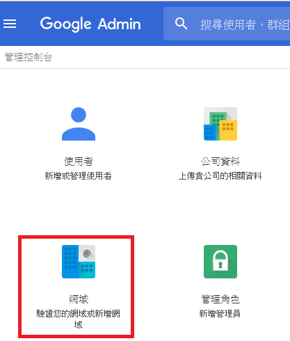

## Step 2

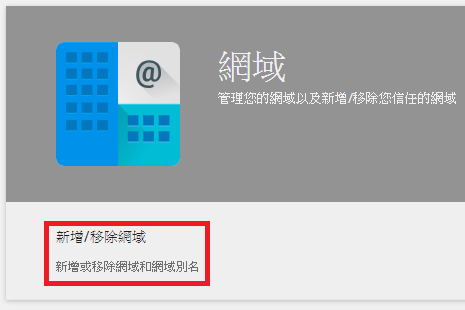

## Step 3

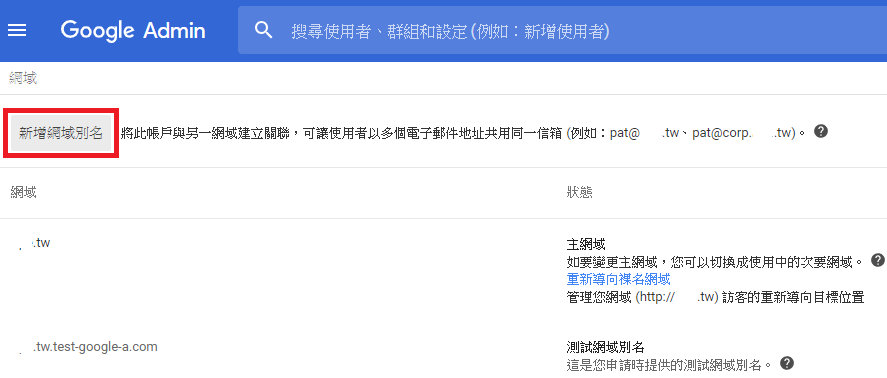

## Step 4

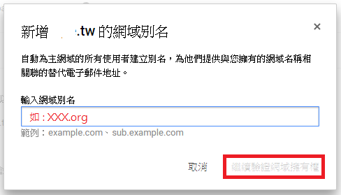

## Step 5

## Step 6

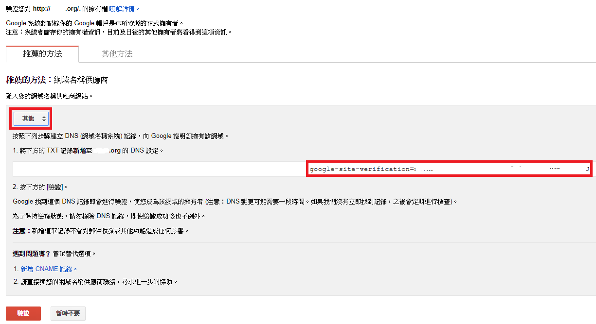

## Step 7

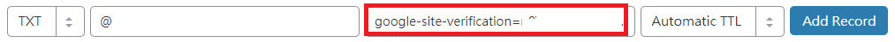

## Step 8

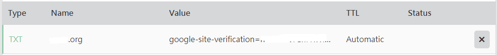

## Step 9

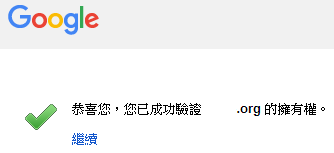

## Step 10

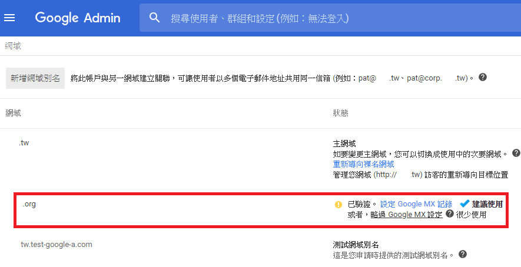

## Step 11

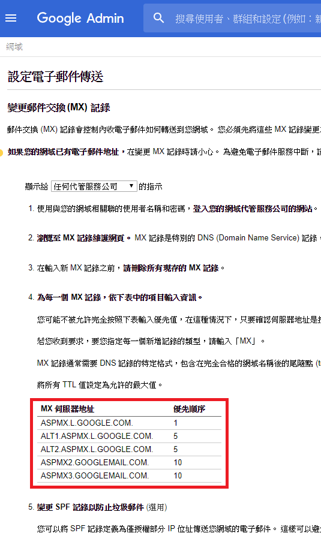

## Step 12

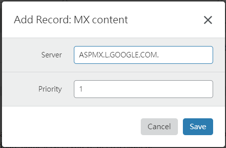

## Step 13

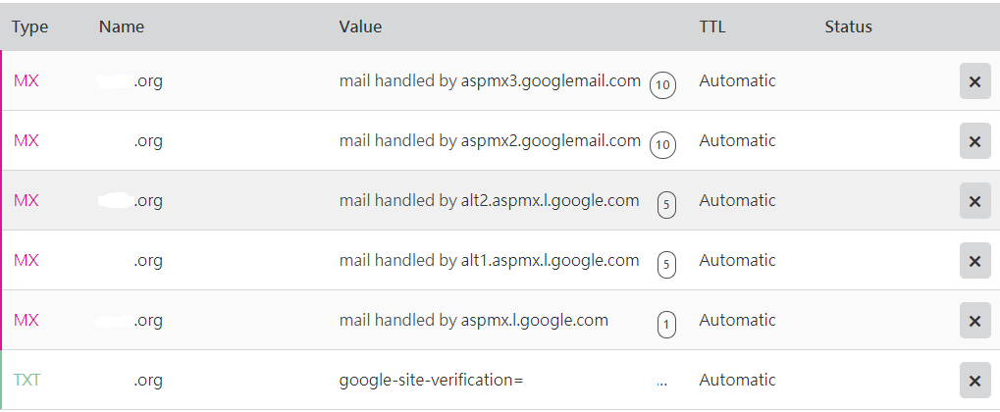

## Step 14

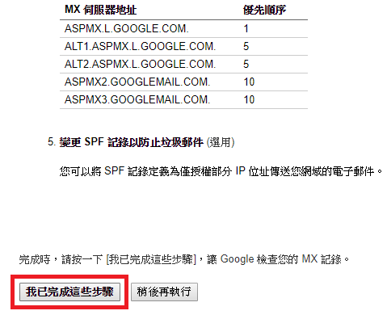

## Step 15

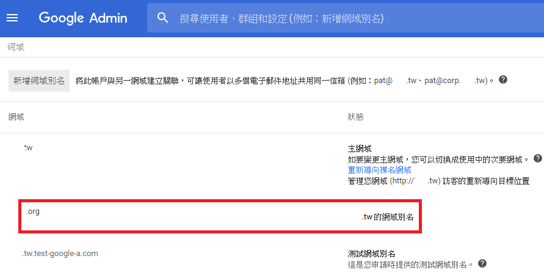


Wait for the configuration to take effect \(may take a few hours\).


## Step 16

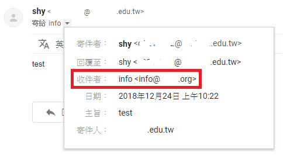

## Step 17

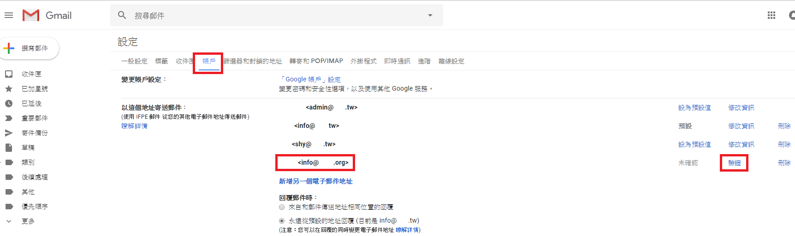

## Step 18

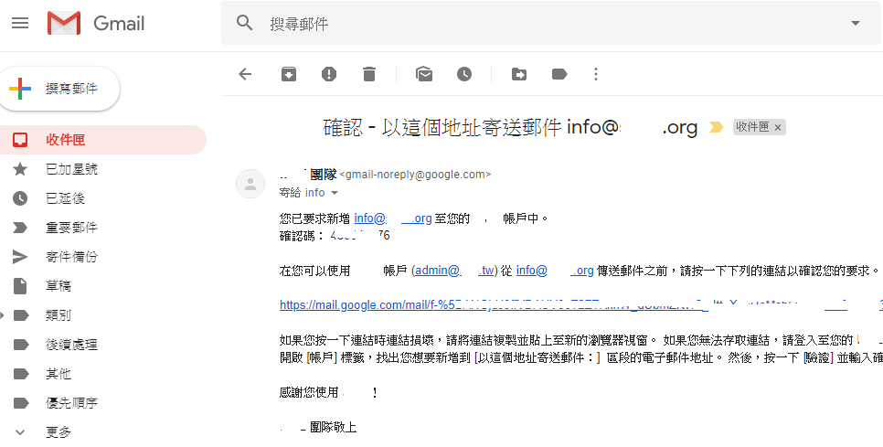

## Step 19

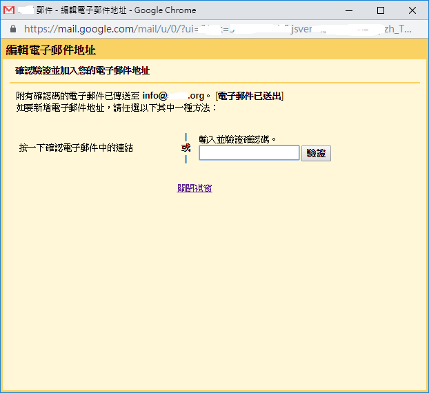

## Step 20

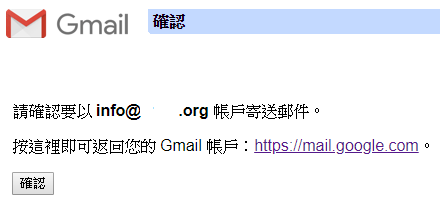

## Step 21

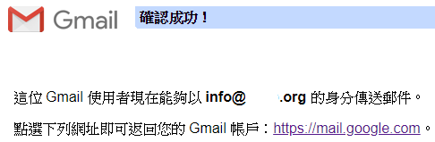

## Step 22

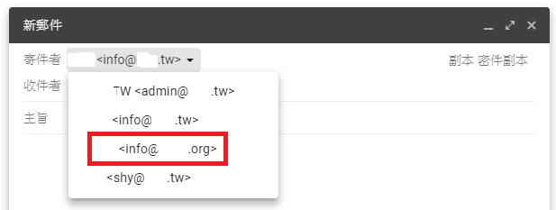

