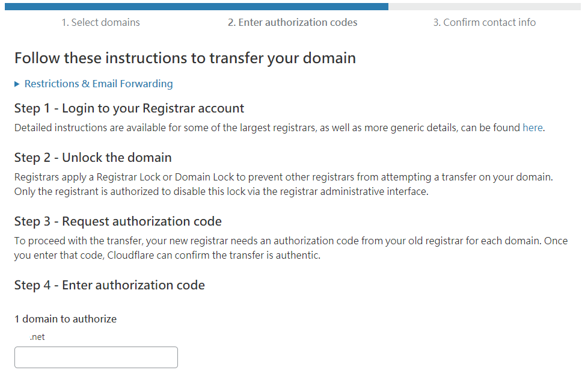

# 網域轉移 \(Domain Transfer\)


gTLD ".net"

Total time : 5 days

Cost : 9.95 USD / year is equal to 315 TWD \(including foreign transaction fees\)


## Step 1: Click "Start Transferring Now"

## Step 2: Click "add a payment method"

## Step 3 : Add a payment method


 In addition to credit card payments, you can also choose to pay with Paypal.


## Step 4:

## Step 5: Select domain

## Step 6: This case selects a .net domain

## Step 7:

## Step 8:

## Step 9: Set domain registrar lock to disabled

## Step 10:

## Step 11: Send a letter to request an EPP/Auth code

## Step 12: Key-in the EPP/Auth code

## Step 13: Key-in your WHOIS record

## Step 14:

## Step 15: Billing email from the cloudflare

## Step 16: Billing email from the bank of the credit card

## Step 17: Notification letter from the domain registrar


Wait to 5 days \(May 15, 2019 - May 20, 2019\)


## Step 18: Check domain status

## Step 19: After 5 days

## Step 20:

