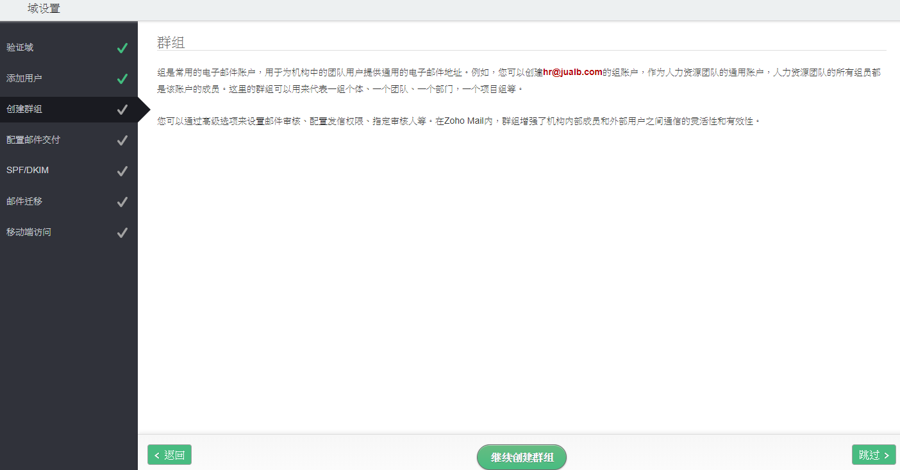
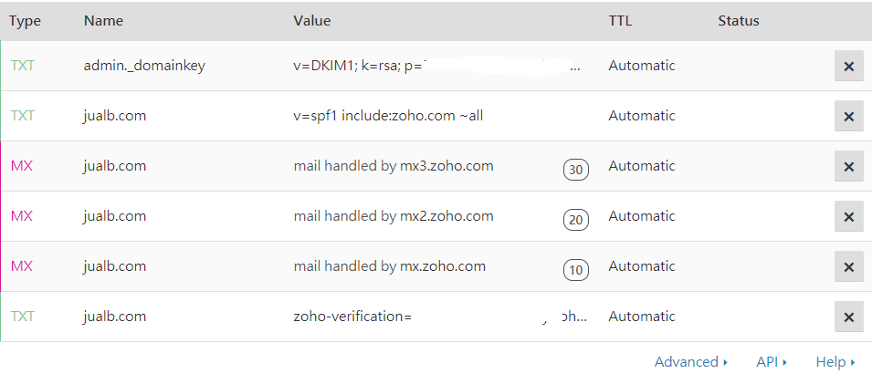

# 自訂網域的電子郵件信箱

## Step 1:

## Step 2:

## Step 3:

## Step 4:

## Step 5:

## Step 6:

## Step 7:

## Step 8:

## Step 9:

## Step 10:

## Step 11:

## Step 12:

## Step 13:

## Step 14:

## Step 15:

## Step 16:

## Step 17:

## Step 18:

## Step 19:

## Step 20:

## Step 21:

## Step 22:

## Step 23:

## Step 24:

## Step 25:

## Step 26:

## Step 27:

## Step 28:

## Step 29:

## Step 30:

## Step 31:

## Step 32: Click "Skip"

## Step 33:

## Step 34:

## Step 35:

## Step 36:

## Step 37: to verify SPF status

## Step 38: SPF status is pass!

## Step 39: DKIM status is pass!

## Step 40:

